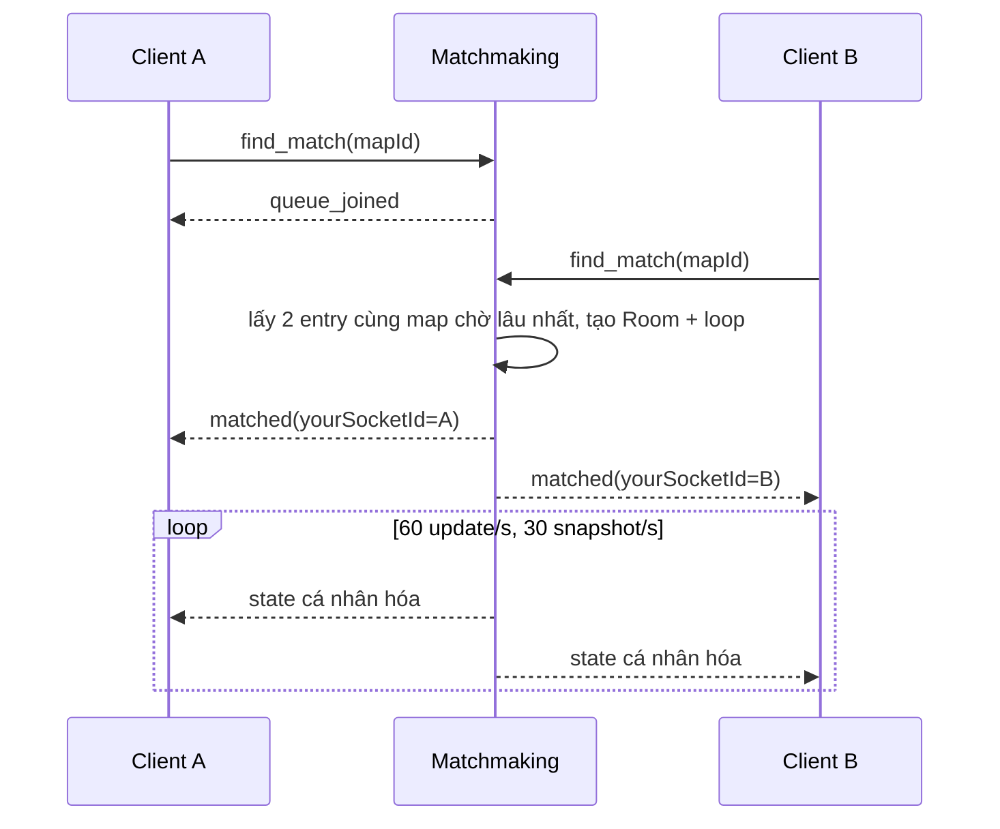
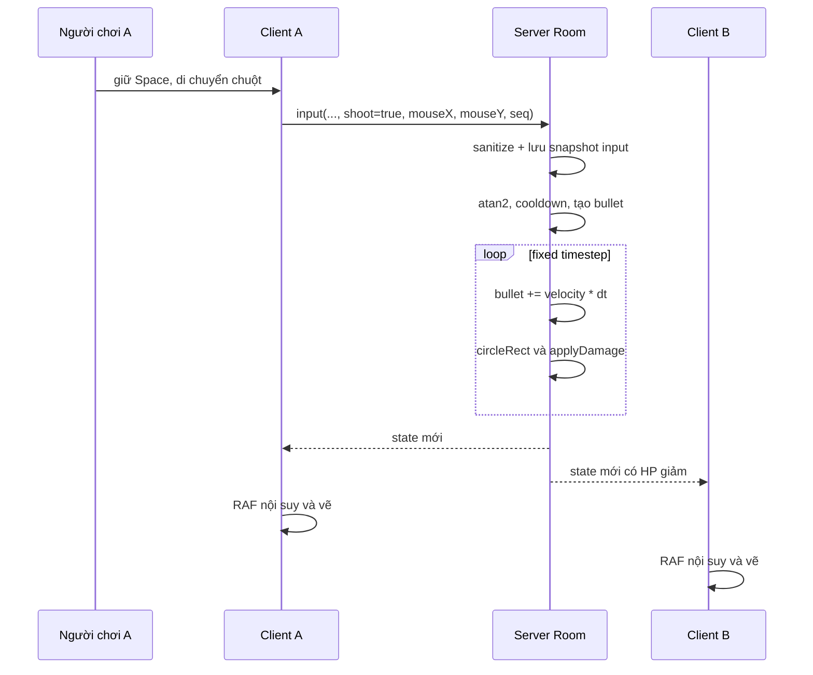

# TANKFIRE - Đặc tả yêu cầu và thiết kế hệ thống

Phiên bản: 1.0  
Phạm vi: mã nguồn sau đợt chỉnh sửa tháng 08/2026  
Ngăn xếp: Node.js, Express, Socket.IO, MySQL, Vite, Canvas 2D

Tài liệu này mô tả những gì đang có trong mã nguồn. Các giới hạn chưa làm được
được ghi riêng ở mục 13, không được trình bày như tính năng đã hoàn thành.

## 1. Mục tiêu và phạm vi

TankFire cho hai người dùng đã xác thực ghép cặp tự động và đấu tank 1v1 trong
một đấu trường 2D. Backend là nguồn sự thật duy nhất cho vị trí, đạn, va chạm,
sát thương và kết quả. Kết quả hợp lệ được lưu vào lịch sử và cập nhật ELO.

Trong phạm vi `[✓]`:

- đăng ký, đăng nhập và xác thực JWT;
- hàng đợi ghép cặp 1v1, hủy tìm trận;
- ba bản đồ có tường, cỏ và sông;
- mô phỏng 60 Hz, snapshot mạng 30 Hz;
- vật phẩm, giáp, hồi sinh, nhiều mạng;
- lịch sử và bảng xếp hạng phân trang;
- chơi nhiều trận trên cùng một kết nối socket.

Ngoài phạm vi có chủ ý `[○]`:

| Tính năng | Lý do | TT |
|---|---|:---:|
| Chọn đối thủ hoặc tạo phòng riêng | Đồ án tập trung vào matchmaking tự động | `[○]` |
| Spectator và chat | Không ảnh hưởng mục tiêu server-authoritative | `[○]` |
| Reconnect vào trận cũ | Trận ngắn; mất kết nối được xử lý là thua | `[○]` |
| Chơi trên điện thoại | Input hiện dùng bàn phím và chuột | `[○]` |
| Chống aimbot hoàn chỉnh | Client vẫn gửi tọa độ con trỏ; server chỉ kiểm tra kiểu và miền | `[○]` |
| Chạy nhiều tiến trình backend | Trạng thái phòng nằm trong RAM của một tiến trình | `[○]` |

## 2. Yêu cầu

### 2.1 Yêu cầu chức năng

| ID | Yêu cầu | Tiêu chí kiểm chứng | TT |
|---|---|---|:---:|
| FR-01 | Đăng ký username duy nhất | Trùng tên trả HTTP 409 | `[✓]` |
| FR-02 | Username chỉ gồm chữ, số, `_`, dài 3-20 | Payload chứa HTML trả HTTP 400 | `[✓]` |
| FR-03 | Đăng nhập đúng cấp JWT 12 giờ | Sai thông tin trả HTTP 401 | `[✓]` |
| FR-04 | Socket chỉ kết nối với JWT hợp lệ | Thiếu/sai token bị middleware từ chối | `[✓]` |
| FR-05 | Một người chỉ có một vị trí trong queue | Gọi `find_match` lặp không tạo bản sao | `[✓]` |
| FR-06 | Người đang chờ có thể hủy | `cancel_match` đưa socket về `IDLE` | `[✓]` |
| FR-07 | Disconnect dọn queue hoặc báo cho phòng | Không còn socket ma trong queue | `[✓]` |
| FR-08 | Hai người chờ lâu nhất cùng chọn một map được ghép | Queue trả đúng hai phần tử tương thích đầu tiên | `[✓]` |
| FR-09 | Mỗi client biết tank của mình | `matched.yourSocketId` khác nhau theo người nhận | `[✓]` |
| FR-10 | Server quyết định toàn bộ gameplay | Client không gửi vị trí, HP hay kết quả | `[✓]` |
| FR-11 | Input lạ hoặc sai kiểu không làm hỏng phòng | Chuỗi/null/NaN bị bỏ qua | `[✓]` |
| FR-12 | Hết mạng kết thúc bằng `WIN` | Winner là người còn sống | `[✓]` |
| FR-13 | Phân biệt `WIN`, `ABORTED`, `DRAW` | Hai người cùng rời không ghi DB | `[✓]` |
| FR-14 | Lịch sử tham chiếu user bằng khóa ngoại | Không xác định winner bằng so sánh tên | `[✓]` |
| FR-15 | API danh sách phân trang ở server | `page`, `limit`, `total`, `items` đúng | `[✓]` |
| FR-16 | Endpoint lịch sử và ranking cần JWT | Không có Bearer token trả HTTP 401 | `[✓]` |

### 2.2 Yêu cầu phi chức năng

| ID | Chỉ tiêu | TT |
|---|---|:---:|
| NFR-01 | Logic vật lý chạy fixed timestep 60 update/giây | `[✓]` |
| NFR-02 | Trạng thái mạng gửi tối đa 30 snapshot/giây | `[✓]` |
| NFR-03 | Client gửi input 30 gói/giây; server nhận tối đa 60 gói/giây/socket | `[✓]` |
| NFR-04 | Mật khẩu dùng bcrypt cost 10, không lưu bản rõ | `[✓]` |
| NFR-05 | Truy vấn chứa dữ liệu ngoài dùng placeholder của `mysql2` | `[✓]` |
| NFR-06 | Không đưa dữ liệu user vào `innerHTML`; ESLint cấm thuộc tính này | `[✓]` |
| NFR-07 | Login giới hạn 5 lần thất bại/phút/IP trong một tiến trình | `[✓]` |
| NFR-08 | Thiếu biến môi trường bắt buộc phải dừng ngay khi khởi động | `[✓]` |

## 3. Kiến trúc

```text
┌──────────────────────── Browser / Vite ────────────────────────┐
│ ui/* ── REST client         game/input.js ── input snapshot    │
│ game/socket.js ── lifecycle game/render.js ── RAF/prediction   │
└──────────────┬───────────────────────────┬──────────────────────┘
               │ HTTPS/JSON                │ Socket.IO
               ▼                           ▼
┌──────────────────────── Node.js backend ───────────────────────┐
│ routes → controllers → models                                 │
│ JWT middleware                 sockets/matchmaking.js          │
│                                ├─ MatchQueue                   │
│                                ├─ playerState + roomBySocket   │
│                                └─ FixedStepLoop                │
│                                          │                     │
│                                game/Room (logic thuần)         │
│                                          │ kết quả             │
│                                persistence/persistMatch        │
└──────────────────────────────────────────┬─────────────────────┘
                                           │ transaction
                                           ▼
                                   MySQL: users, history, ranking
```

### 3.1 Ranh giới trách nhiệm

| Tầng | Được làm | Không được làm |
|---|---|---|
| `game/` | vật lý, va chạm, damage, state game | gọi socket, đọc/ghi DB |
| `sockets/` | queue, trạng thái socket, vòng đời room, emit | chứa SQL hoặc công thức gameplay |
| `persistence/` | transaction lịch sử và ELO | emit socket, sửa state room |
| `controllers/` | validate HTTP, phân trang, response | chạm state realtime |
| frontend | gửi input, nội suy và vẽ | tự quyết định HP/winner |

Phụ thuộc đi từ tầng giao tiếp vào lõi game. `Room` không biết Socket.IO và
MySQL tồn tại, vì vậy test không cần server hoặc database.

### 3.2 Cấu trúc thư mục

```text
tankfire/
├── shared/gameConstants.json       nguồn hằng số chung
├── backend/
│   ├── schema.sql, setup-db.js
│   ├── src/
│   │   ├── index.js, config.js, db.js
│   │   ├── controllers/            HTTP handlers và pagination
│   │   ├── middleware/             JWT, async errors, rate limit
│   │   ├── models/userModel.js     truy cập bảng users
│   │   ├── game/                   logic game thuần
│   │   ├── sockets/                queue và room lifecycle
│   │   └── persistence/            transaction match + ELO
│   └── test/                       unit test
├── frontend/
│   ├── index.html
│   └── src/
│       ├── api.js, config.js, main.js
│       ├── game/                   socket, input, renderer
│       └── ui/                     auth, lobby, bảng dữ liệu
└── docs/SDD.md
```

## 4. Hằng số và đơn vị

Giá trị gốc nằm trong `shared/gameConstants.json`. Backend và frontend chỉ tạo
adapter tên biến; không sao chép giá trị.

| Hằng số | Giá trị | Đơn vị / ý nghĩa |
|---|---:|---|
| `ARENA_WIDTH`, `ARENA_HEIGHT` | 800, 600 | pixel |
| `SIMULATION_HZ` | 60 | update/giây |
| `BROADCAST_HZ` | 30 | snapshot/giây |
| `INPUT_HZ` | 30 | input/giây |
| `TANK_SIZE` | 32 | pixel |
| `TANK_SPEED` | 132 | pixel/giây |
| `TANK_HP` | 100 | HP |
| `PLAYER_LIVES` | 2 | mạng/người |
| `BULLET_SPEED` | 420 | pixel/giây |
| `BULLET_DAMAGE` | 20 | HP/phát |
| `SHOT_COOLDOWN_MS` | 500 | mili giây |
| `RESPAWN_DELAY_MS` | 2000 | mili giây |
| `ITEM_SPAWN_INTERVAL_MS` | 3300 | mili giây |
| `ITEM_PICKUP_SIZE` | 16 | pixel, hitbox nhặt vật phẩm |

Tốc độ được biểu diễn theo giây thay vì theo tick. Đổi tần số mô phỏng không
làm tank hoặc đạn nhanh/chậm theo.

## 5. Thiết kế gameplay

### 5.1 Hệ tọa độ và di chuyển

Gốc tọa độ nằm ở góc trái trên; trục x sang phải, trục y hướng xuống. Input tạo
vector hướng:

```text
dx = right - left
dy = down - up
direction = (dx, dy) / hypot(dx, dy), nếu độ dài khác 0
position += direction × speed(px/s) × dt(s)
```

Chuẩn hóa vector loại lỗi đi chéo nhanh hơn `sqrt(2)` lần. Server thử trục x và
y riêng để tank có thể trượt dọc vật cản, sau đó kẹp trong biên arena.

### 5.2 Bản đồ và va chạm

Ba map dùng cùng dạng dữ liệu `{ walls, grass, rivers }`. Tường lớn được tách
thành tile 32 px khi tạo `Room`; mỗi tile chịu ba phát trước khi bị phá. Sông
chặn di chuyển. Cỏ che đối thủ và đạn của đối thủ khỏi snapshot người xem.

`rectRect` xử lý tank với vùng chữ nhật. `circleRect` xử lý đạn tròn với tank và
tường, kể cả trường hợp chạm góc.

### 5.3 Ngắm và bắn

Client gửi con trỏ trong hệ tọa độ canvas. Server tính:

```text
angle = atan2(mouseY - tankCenterY, mouseX - tankCenterX)
velocity = (cos(angle), sin(angle)) × 420 px/s
```

Trước cập nhật và sau dịch chuyển, tọa độ/vận tốc đạn phải là số hữu hạn. Đạn
sai, ra biên, trúng tường hoặc trúng tank được xóa ngay.

### 5.4 Sát thương, vật phẩm và kết thúc

Giáp hấp thụ tối đa 10 điểm mỗi phát. Shield chặn toàn bộ damage trong thời hạn.
Khi HP về 0 và còn mạng, player hồi sinh sau 2 giây; power-up tạm thời được reset.
Khi hết mạng cuối, `Room` kết thúc `WIN`.

Vật phẩm: heal, armor, speed, rapid, shield và multi-shot. ID vật phẩm dùng bộ
đếm theo room, không dùng thời gian hệ thống nên không trùng trong cùng room.

Điểm hiển thị cuối trận là `lives × 100 + hp`; điểm này chỉ tóm tắt trạng thái
cuối trận và không dùng để xếp hạng.

## 6. Mô hình dữ liệu

```text
users
  id PK
  username UNIQUE
  password_hash
       │
       ├──────────────┐
       ▼              ▼
match_history       ranking
  player1_id FK       user_id PK/FK
  player2_id FK       rating
  winner_id FK        matches_played
  username snapshots  matches_won
  end_reason           last_played_at
  started/ended
```

`users` và `match_history` là dữ liệu gốc. `ranking` là dữ liệu dẫn xuất để đọc
nhanh. `rebuildRanking()` có thể xóa và phát lại lịch sử theo thời gian để dựng
lại ELO, số trận và số trận thắng.

Tên người chơi vẫn được snapshot trong lịch sử để giao diện giữ đúng tên tại
thời điểm thi đấu; quan hệ và winner luôn xác định bằng `user_id`, không so sánh
chuỗi. `setup-db.js` vừa tạo schema mới vừa migrate schema cũ tại chỗ.

### 6.1 ELO

Mọi user bắt đầu ở 1000, hệ số K bằng 32:

```text
expectedA = 1 / (1 + 10 ^ ((ratingB - ratingA) / 400))
newA = ratingA + round(32 × (actualA - expectedA))
```

`actualA` bằng 1 nếu thắng và 0 nếu thua. Với trận `ABORTED`, người còn kết nối
được tính thắng. `DRAW` do cả hai rời không được lưu và không đổi ELO.

Insert `match_history` và hai lần upsert `ranking` nằm trong cùng transaction.
Một bước lỗi sẽ rollback toàn bộ, tránh lịch sử và ranking lệch nhau.

## 7. Máy trạng thái

### 7.1 Vòng đời socket

```text
JWT connect
    │
    ▼
  IDLE ──find_match──► QUEUED ──paired──► IN_GAME
    ▲                    │                    │
    └──queue_cancelled───┘                    │
    └──────────── match_end/opponent_left ───┘

Từ mọi trạng thái: disconnect → dọn queue, room index, input timestamp, socket map
```

| Chuyển trạng thái | Tạo | Dọn |
|---|---|---|
| `IDLE → QUEUED` | một queue entry | không |
| `QUEUED → IDLE` | không | queue entry |
| `QUEUED → IN_GAME` | room, loop, hai index socket-room | queue entries |
| `IN_GAME → IDLE` | không | loop, room, index, input timestamp |
| `disconnect` | không | mọi đăng ký của socket |

Bất biến: một socket chỉ ở một trạng thái và thuộc tối đa một room. Handler
`input`/`disconnect` được gắn đúng một lần khi socket kết nối; định tuyến bằng
`roomBySocket`, không gắn listener mới mỗi trận.

### 7.2 Vòng đời trận

```text
CREATED → RUNNING → ENDED(WIN | ABORTED | DRAW)
```

| Lý do | Điều kiện | Winner | Ghi DB |
|---|---|---|:---:|
| `WIN` | một người hết mạng | người còn sống | có |
| `ABORTED` | một socket rời, một socket còn | người ở lại | có |
| `DRAW` | cả hai socket rời trước lần đánh giá kế | không | không |

Loop dừng và session được đánh dấu `finishing` trước mọi thao tác async, nên một
trận không thể persist hai lần.

### 7.3 Màn hình frontend

```text
AUTH → LOBBY → QUEUED → IN_GAME → RESULT → LOBBY
  ▲       │                                      │
  └logout┘       HISTORY / RANKING overlay ◄─────┘
```

## 8. Ranh giới tin cậy và bảo mật

| Dữ liệu | Nguồn | Kiểm tra server |
|---|---|---|
| username/password | HTTP client | kiểu, regex, độ dài, bcrypt |
| JWT | HTTP/socket client | chữ ký và hạn dùng |
| mapId | socket client | phải có trong registry map |
| phím | socket client | danh sách trường cố định, `=== true` |
| mouseX/mouseY | socket client | phải là number hữu hạn, kẹp arena |
| seq | socket client | số nguyên an toàn, bỏ gói cũ |
| vị trí/HP/winner | server | client không được gửi |

Phòng thủ XSS có hai lớp: đăng ký không nhận ký tự HTML và frontend tạo DOM bằng
`createElement`/`textContent`. CORS lấy whitelist từ môi trường. API dữ liệu dùng
Bearer token. Body JSON giới hạn 16 KB; input socket được giới hạn tần suất.

## 9. Giao thức Socket.IO

### 9.1 Client gửi server

| Event | Trạng thái hợp lệ | Payload |
|---|---|---|
| `find_match` | `IDLE` | `{ mapId: 'map1' | 'map2' | 'map3' }` |
| `cancel_match` | `QUEUED` | không |
| `input` | `IN_GAME` | `{ up, down, left, right, shoot, mouseX, mouseY, seq }` |
| `disconnect` | mọi trạng thái | Socket.IO tự phát |

### 9.2 Server gửi client

| Event | Payload | Mục đích |
|---|---|---|
| `queue_joined` | `{ mapId, position }` | xác nhận vào queue |
| `queue_cancelled` | không | xác nhận hủy |
| `matchmaking_error` | `{ code }` | thao tác sai state hoặc user đang hoạt động ở tab khác |
| `matched` | `{ roomId, yourSocketId, opponentName, map }` | khởi tạo màn game |
| `state` | `{ roomId, serverTime, tick, mapUpdate?, players, bullets, items, ... }` | snapshot cá nhân hóa |
| `game_over` | `{ endReason, winner, players }` | kết quả cuối |

`matched` được emit riêng cho từng socket để `yourSocketId` và `opponentName`
đúng người nhận. Frontend đánh dấu tank cục bộ bằng màu vàng, nhãn `YOU` và mũi
tên, không chỉ dựa vào màu.

Map đầy đủ chỉ gửi một lần trong `matched`. Snapshot sau đó chỉ có `mapUpdate`
khi `mapRevision` thay đổi do tường trúng đạn; grass, river và metadata không bị
lặp 30 lần/giây. Mỗi player state trả `lastProcessedSeq` để client có điểm đối
soát. Renderer bỏ input đã được server xác nhận, dự đoán ngắn tối đa 100 ms cho
tank cục bộ và quay về snapshot authoritative mới nhất khi state kế tiếp đến.

## 10. HTTP API

| Method | Route | Auth | Response chính |
|---|---|:---:|---|
| GET | `/api/health` | không | `{ status: 'ok' }` |
| POST | `/api/register` | không | 201 `{ id, username }` |
| POST | `/api/login` | không | 200 `{ token, user }` |
| GET | `/api/match-history?page=1&limit=20` | có | `{ items, total, page, limit }` |
| GET | `/api/match-history/:matchId` | có | chi tiết trận |
| GET | `/api/ranking?page=1&limit=20` | có | `{ items, total, page, limit }` |

`limit` được kẹp từ 1 đến 100. Express 4 handler async đều đi qua `asyncHandler`;
error middleware cuối chuỗi luôn trả response 500 thay vì để request treo.

## 11. Trình tự xử lý

### 11.1 Matchmaking



### 11.2 Một phát bắn



## 12. Truy vết yêu cầu - mã - test

| Yêu cầu | Module / hàm | Test / kiểm chứng | TT |
|---|---|---|:---:|
| FR-01 | `authController.register`, `userModel.createUser` | `authValidation.test.js`, API MySQL thật | `[✓]` |
| FR-02 | `validateCredentials` | `authValidation.test.js` | `[✓]` |
| FR-03 | `authController.login` | login bằng MySQL thật | `[✓]` |
| FR-04 | `index.js: io.use` | smoke test hai Socket.IO client có JWT | `[✓]` |
| FR-05 | `matchQueue.enqueue`, `findMatch` | `matchQueue.test.js`, `matchmaking.test.js` | `[✓]` |
| FR-06 | `matchmaking.cancelMatch` | `matchmaking.test.js` | `[✓]` |
| FR-07 | `matchmaking.disconnect` | `matchmaking.test.js` | `[✓]` |
| FR-08 | `matchQueue.enqueue`, `createRoom` | queue theo map + smoke test hai client | `[✓]` |
| FR-09 | `matched.yourSocketId`, `drawTank` | `matchmaking.test.js`, kiểm tra UI hai browser | `[✓]` |
| FR-10 | `game/Room` | `room.test.js` | `[✓]` |
| FR-11 | `sanitizeInput`, `handleInput` | `input.test.js`, `room.test.js` | `[✓]` |
| FR-12 | `Room.applyDamage/checkGameOver` | `room.test.js` | `[✓]` |
| FR-13 | `Room.checkGameOver`, `finishSession` | `room.test.js`, `matchmaking.test.js` | `[✓]` |
| FR-14 | `persistMatch`, `schema.sql` | `persistence.test.js`, setup DB thật | `[✓]` |
| FR-15 | `parsePagination`, list controllers | `pagination.test.js`, API MySQL thật | `[✓]` |
| FR-16 | `verifyToken`, protected routes | gọi API không/có Bearer token | `[✓]` |
| NFR-01 | `FixedStepLoop` | `fixedStepLoop.test.js` | `[✓]` |
| NFR-02 | `FixedStepLoop.onBroadcast` | `fixedStepLoop.test.js` | `[✓]` |
| NFR-03 | `input.startInput`, `handleInput` | review singleton + input tests | `[✓]` |
| NFR-04 | `authController`, `userModel` | auth/model tests + login MySQL thật | `[✓]` |
| NFR-05 | models/controllers/persistence | prepared-statement review + persistence tests | `[✓]` |
| NFR-06 | DOM components, ESLint | regex test + rule cấm `innerHTML` | `[✓]` |
| NFR-07 | `loginRateLimit` | kiểm tra cấu hình 5 lỗi/phút | `[✓]` |
| NFR-08 | `config.js` | `config.test.js` + setup máy mới | `[✓]` |

Bộ hiện tại có 50 unit test, gồm lifecycle matchmaking bằng socket/loop giả,
fixed timestep, async error forwarding, transaction/rebuild persistence và
contract model-schema. Node test coverage đo được 88.10% số dòng của các module
backend được nạp. Test HTTP với MySQL thật và smoke test hai Socket.IO client
được chạy theo kịch bản nghiệm thu, chưa được nhận là browser E2E tự động trong CI.

## 13. Giả định, giới hạn và nợ kỹ thuật

### 13.1 Quyết định có chủ ý

- Room nằm trong RAM để kiến trúc một tiến trình đơn giản và dễ demo.
- Client gửi tọa độ chuột để điều khiển tự nhiên; server validate nhưng không thể
  phân biệt aim hợp lệ với aimbot.
- Snapshot chứa full state ở 30 Hz. Với room 1v1 và tối đa ba item, chi phí nhỏ
  hơn độ phức tạp của delta protocol.
- Ranking được tiền tổng hợp, nhưng có transaction và lệnh `npm run rebuild:ranking`
  để dựng lại từ lịch sử.

### 13.2 Giới hạn đã biết

| Giới hạn | Ảnh hưởng | Hướng phát triển |
|---|---|---|
| Không reconnect vào room | rớt mạng bị xử thua | token reconnect + grace period |
| Prediction chỉ áp dụng cho tank cục bộ trong 100 ms | chưa có lag compensation cho phát bắn | thêm timestamp đồng bộ và rewind hitbox |
| Interpolation chỉ tuyến tính vị trí | góc có thể đổi đột ngột | nội suy góc theo cung ngắn nhất |
| Rate limit login lưu trong RAM | reset khi restart, không chia sẻ đa node | Redis hoặc gateway rate limit |
| Chưa có integration test HTTP/socket | rủi ro nằm ở wiring | thêm test server với DB test riêng |
| CORS phụ thuộc cấu hình đúng | origin mới bị chặn | quản lý env theo môi trường |

## 14. Vận hành và kiểm chứng

Quy trình máy mới nằm trong `README.md`. Các cổng mặc định:

- frontend: `http://localhost:5173`;
- backend: `http://localhost:3001`;
- health check: `GET http://localhost:3001/api/health`.

Lệnh nghiệm thu:

```bash
npm install
cd backend && node setup-db.js && cd ..
npm run check
npm run dev:backend
npm run dev:frontend
```

Kịch bản demo tối thiểu:

1. Đăng ký hai user, xác minh username HTML bị từ chối.
2. Bấm Find nhiều lần và hủy; queue không trùng.
3. Một user đóng tab khi chờ; user tiếp theo không bị ghép với socket cũ.
4. Chơi hai trận liên tiếp trên cùng kết nối; input không tăng tần suất.
5. Nhận diện được `YOU`; tank không đi xuyên sông/tường; đạn phá được tường.
6. Thắng bình thường và disconnect một phía; lịch sử/ELO cập nhật đúng.
7. Hai phía rời gần đồng thời; không có bản ghi rác.
